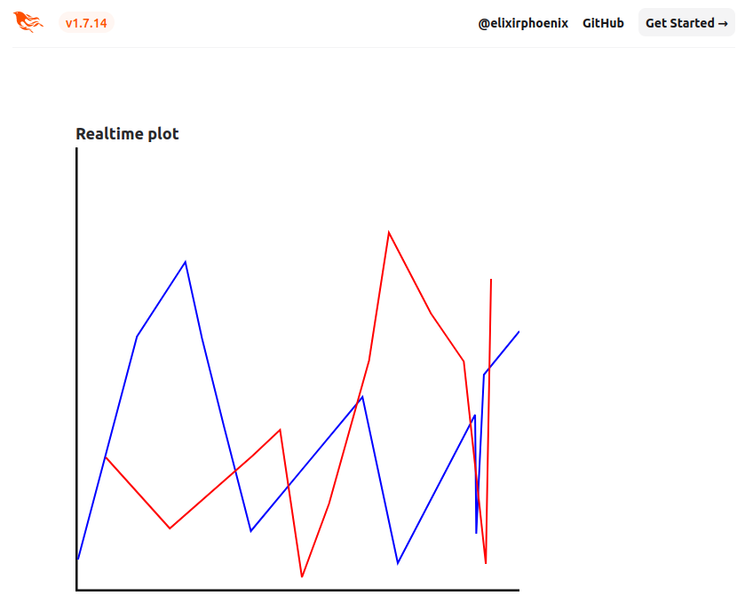

# Call JavaScript function on the client


Problem: we have measurements on the server (from a multimeter, powermeter or whatnot)
and the measurements shall be displayed on a web GUI in a SVG in realtime.

The SVG shows the data as polylines. For this example, currently 2 polylines are possible.

To add a new point to a polyline in the SVG, we need to call JavaScript code on the client.
This repo shows an example how this can be achieved.

## Implementation

The SVG is defined in index.html.heex

```
  <svg id="xyplot" width="500" height="500">
        <line x1="0" y1="0" x2="0" y2="500" stroke="black" stroke-width="5" />
        <line x1="0" y1="500" x2="500" y2="500" stroke="black" stroke-width="5" />
        <g id="transformer" transform="translate(0,500)">
            <g transform="scale(1,-1)">
              <polyline id="polyline1"
                        points="500,500"
                        fill="none"
                        stroke="blue"
                        stroke-width="2" />
              <polyline id="polyline2"
                        points="500,500"
                        fill="none"
                        stroke="red"
                        stroke-width="2" />
            </g>
        </g>
    </svg>
```

The device and data collection is currently simulated in a timer callback in a LiveView (index.ex):
The real project maintains connections to several measurement devices to control them a collect measurement data.

```
  def handle_info(:timer, socket) do
    Process.send_after(self(), :timer, 200)
    [plid] = Enum.take_random(1..2, 1)
    pl = "polyline" <> to_string(plid)
    y = :rand.uniform() * 100
    t = :rand.uniform() * 10
    {:noreply, push_event(socket, "xy_plot_event", %{id: pl, t: t, y: y})}
  end
```

xy_plot_event is the ID for this kind of push events,
the map parameter contains
- id is the CSS ID of the polyline inside of the SVG
- t  is the delta time to the last measurement
- y  is the data value

Currently the polylines are directly accessed (as "polyline1" and "polyline2"), i.e., they would not be globally unique
if the DOM would contain multiple SVGs.
Also the colour and style are hardcoded.

The JS code on the client is:

```
import { add_point } from "./svg_plot"

window.addEventListener("phx:xy_plot_event", (e) => {
    if(document.getElementById(e.detail.id)) {
        add_point(e.detail.t, e.detail.y, e.detail.id)
    }
})
```

This defines an event listener which calls add_point with the DOM element (the polyline inside of the SVG) and the new data point.

## Setup and execution

  * Run `mix setup` to install and setup dependencies
  * Start Phoenix endpoint with `mix phx.server` or inside IEx with `iex -S mix phx.server`

Now you can visit [`localhost:4000`](http://localhost:4000) from your browser.


